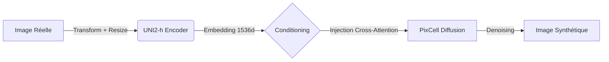

-----

# 🧬 PixCell Gated: Pipeline d'Inférence Conditionnelle

Ce dossier contient l'implémentation de l'approche **"Gated"** (ou *Zero-Shot*) pour la génération d'images histopathologiques. Cette méthode utilise le modèle de diffusion **PixCell** pré-entraîné, conditionné directement par les embeddings sémantiques extraits par le Foundation Model **UNI2-h**.

Aucun entraînement n'est réalisé ici : il s'agit d'évaluer la capacité du modèle pré-entraîné à généraliser sur notre domaine (NCT-CRC-HE) via un conditionnement par l'image (*Image-to-Image / Re-sampling*).

## ⚙️ Architecture du Pipeline

Le flux de données repose sur l'interaction entre deux modèles figés (*frozen*) :

1.  **Encodeur (UNI2-h)** : Extrait un vecteur de caractéristiques ($1 \times 1536$) à partir d'une image réelle de référence.
2.  **Générateur (PixCell)** : Modèle de diffusion latent qui utilise ce vecteur comme conditionnement pour générer une nouvelle variation de l'image.

<!-- end list -->



## 🛠️ Implémentation Technique & "Monkey-Patching"

L'utilisation de PixCell avec la librairie standard `diffusers` nécessite une adaptation spécifique du code, car le modèle attend nativement des prompts textuels ou un format de conditionnement différent.

### 1\. Le "Monkey-Patch"

Pour injecter les embeddings visuels d'UNI2-h (dimension 1536) directement dans le Transformer de PixCell, nous appliquons un **monkey-patch** sur la classe `PixArtTransformer2DModel`.

  * **Problème :** Le pipeline standard s'attend à un embedding textuel (T5/CLIP) de dimension 4096 ou 1152.
  * **Solution :** Nous surchargeons la méthode `forward` ou le module d'embedding pour accepter nos tenseurs `[Batch, 1, 1536]`. Cela permet de "court-circuiter" l'encodeur de texte et de forcer l'utilisation de l'embedding histologique.

### 2\. Gestion du Foundation Model (UNI2-h)

Le modèle UNI2-h est chargé via `timm` en mode évaluation.

  * **Astuce d'intégration :** Les poids doivent être chargés manuellement depuis le checkpoint `.bin`.
  * **Attention aux dimensions :** UNI2-h attend strictement des images en **224x224**. Une étape de redimensionnement est critique avant l'encodage, indépendamment de la taille de génération de PixCell (256x256).

### 3\. Normalisation Vahadane

Pour garantir que le conditionnement capture la structure tissulaire et non les biais de coloration, les images de référence passent par une **normalisation Vahadane** avant d'être envoyées à UNI2-h.

## 🚀 Utilisation

Le script principal charge le pipeline et génère des images basées sur des échantillons du dataset de validation.

```python
# Pseudo-code d'utilisation
from models import load_uni2h, load_pixcell_gated

# 1. Chargement des modèles (Frozen)
uni_model = load_uni2h(device="cuda")
pipeline = load_pixcell_gated(model_path="...", device="cuda")

# 2. Monkey-Patching (Automatique au chargement)
# Le pipeline est modifié pour accepter 'encoder_hidden_states' custom

# 3. Extraction de l'embedding
real_img = load_image("tumeur.png") # + Normalisation Vahadane
emb = uni_model(preprocess(real_img)) # [1, 1536]

# 4. Génération
image = pipeline(
    num_inference_steps=20,
    encoder_hidden_states=emb.unsqueeze(1),
    guidance_scale=4.5
).images[0]
```

## ⚠️ Limitations observées

Bien que fonctionnelle, cette approche "naïve" présente un **Domain Shift** :

  * Le modèle PixCell de base a été entraîné sur un large corpus (TCGA, etc.) qui diffère de la colorimétrie spécifique du dataset NCT-CRC-HE.
  * Sans fine-tuning (LoRA/Adapter), les images générées peuvent présenter des incohérences de texture ou de teinte par rapport à la cible.

C'est pour pallier ce défaut que l'approche **Trainable (Adapter + LoRA)** a été développée (voir section correspondante).