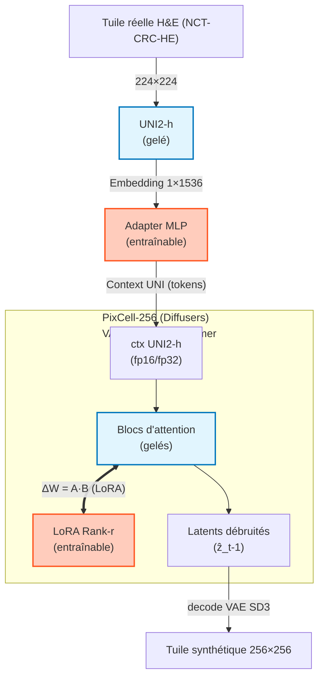

---

# 🧠 PixCell + UNI2-h : Adapter + LoRA dans le notebook `08_UNI2h_Adapter_PixCell_LoRA`

Ce notebook met en place une adaptation **légère mais complète** du modèle génératif **PixCell-256** au domaine NCT-CRC-HE, en combinant :

* un **Adapter** entraînable entre l’encodeur **UNI2-h** et le backbone PixCell,
* des **LoRA “allégées”** injectées manuellement dans les couches d’attention du transformeur PixCell,
* une **boucle de diffusion OOM-friendly** (micro-batch, gradient accumulation, gradient checkpointing).

---

## 📐 Architecture effective dans ce notebook

Le pipeline complet peut se résumer ainsi :



### Points clés :

* **UNI2-h** est entièrement gelé : il sert de *backbone sémantique* pour extraire un embedding 1×1536 par image.
* L’**Adapter MLP** projette cet embedding UNI dans l’espace de conditionnement attendu par PixCell (dimension de contexte du transformer).
* Les **LoRA** sont appliquées **dans les couches d’attention** du transformer PixCell (self/cross-attention, sous-ensemble “allégé” de modules).
* Le **VAE SD3** (`stabilityai/stable-diffusion-3.5-large`, sous-dossier `vae`) est utilisé comme encodeur/décodeur de latents.

---

## 🧩 Particularités techniques de ce notebook

### 1. Compatibilité `diffusers` / `peft` / `transformers`

Les versions récentes de `diffusers` et `peft` attendent un module :

```python
transformers.modeling_layers.GradientCheckpointingLayer
```

qui n’existe plus dans `transformers>=4.45`.
Pour empêcher `peft` de casser l’import **alors qu’on ne l’utilise pas réellement**, le notebook :

* crée un **module factice** `transformers.modeling_layers` avec un stub `GradientCheckpointingLayer`,
* force la désactivation du backend PEFT via des flags globaux (`USE_PEFT_BACKEND = False` côté diffusers),
* évite tout chargement automatique de LoRA via `peft` :
  👉 **les LoRA sont gérées manuellement dans ce notebook, sans `PeftModel`.**

Cela permet :

* de charger `PixCell-256` comme **pipeline diffusers classique**,
* d’attacher nos LoRA custom sans dépendre des conventions `peft`.

### 2. Chargement du pipeline PixCell

Le pipeline est construit explicitement :

* VAE SD3 externe (recommandé par les auteurs de PixCell),
* pipeline PixCell avec code distant (`trust_remote_code=True`).

En pratique :

```python
sd3_vae = AutoencoderKL.from_pretrained(
    "stabilityai/stable-diffusion-3.5-large",
    subfolder="vae",
    torch_dtype=DTYPE,
)

pipe = DiffusionPipeline.from_pretrained(
    "StonyBrook-CVLab/PixCell-256",
    vae=sd3_vae,
    custom_pipeline="StonyBrook-CVLab/PixCell-pipeline",
    trust_remote_code=True,
    torch_dtype=DTYPE,
).to(device)

_pipe = pipe  # alias utilisé partout dans le notebook
```

Le **backbone de diffusion** (transformer PixCell) est ensuite référencé via un alias (`BACKBONE`) pour la boucle d’entraînement.

### 3. Adapter UNI2-h → contexte PixCell

L’Adapter est un petit MLP :

* entrée : tensor `[B, 1, 1536]` issu de UNI2-h,
* sortie : `[B, T, C_ctx]` (dimension de contexte attendue par PixCell),
* entraîné en **FP32**, puis cast en `MODEL_DTYPE` (FP16) pour rester compatible avec le backbone.

Il est appliqué **à la fois** :

* sur l’**embedding positif** (image réelle),
* sur l’**embedding “unconditional”** récupéré via `_pipe.get_unconditional_embedding(B)` pour la guidance.

---

## ⚙️ Boucle d’entraînement : diffusion + LoRA + Adapter

L’entraînement suit le schéma classique des modèles de diffusion, adapté à PixCell :

1. **Dataset & loader**

   * Dataset : **NCT-CRC-HE-100K** (`data/NCT-CRC-HE-100K`), 9 classes histo (`ADI, BACK, DEB, LYM, MUC, MUS, NORM, STR, TUM`).
   * Chaque sample renvoie une image RGB 256×256, re-scalée en **[-1, 1]** pour le VAE.
   * Les labels de classe sont disponibles pour l’équilibrage (sampler), mais **aucune perte de classification n’est encore utilisée** dans ce notebook :
     👉 les LoRA sont conditionnées **uniquement via UNI2-h**, pas via une tête de classe.

2. **Passage dans le VAE**

   * encodage dans l’espace latent,
   * redimensionnement et scaling via `VAE.config.scaling_factor`.

3. **Bruitage / scheduler**

   * choix aléatoire d’un timestep `t`,
   * ajout de bruit gaussien `ε` sur les latents,
   * utilisation du scheduler Diffusers configuré pour **apprentissage en mode “ε-prediction”** (ou `v_prediction` selon config).

4. **Conditionnement UNI2-h**

   * conversion batch `x ∈ [-1,1]` → `[0,1]` → liste de `PIL.Image`,
   * extraction des embeddings UNI2-h (`uni_embeds_for_pixcell`),
   * passage dans l’Adapter pour obtenir les contextes `pos_ctx` et `neg_ctx`,
   * construction de `added_cond_kwargs` (résolution, aspect ratio, etc.) selon les conventions PixCell.

5. **Prédiction de bruit par le backbone**

   * appel au transformer PixCell (`BACKBONE`) avec :

     * `noisy_latents`,
     * `timesteps`,
     * `encoder_hidden_states=pos_ctx`,
     * `added_cond_kwargs=...`,
   * récupération de `model_pred` (bruit prédit, éventuellement concat `[ε | log_var]` selon la config).

6. **Loss & optimisation**

   * **Loss principale** : MSE entre `model_pred` (ou sa composante ε) et la cible `target` définie par le scheduler,
   * normalisation par `ACCUM_STEPS`,
   * **micro-batching** (`MICRO_BATCH = 1`) + **gradient accumulation** (`ACCUM_STEPS` > 1),
   * **gradient checkpointing** + **tiling VAE** pour tenir dans la VRAM,
   * optimisation avec `AdamW` sur :

     * paramètres LoRA (attention layers ciblées),
     * paramètres de l’Adapter.

> 📌 À ce stade, **aucune supervision explicite par classe** n’est utilisée :
> la séparation inter-classes repose uniquement sur ce que UNI2-h encode déjà dans ses embeddings.

---

## 🧪 Mini-génération de contrôle

Le notebook contient une “mini-génération” :

* échantillonne quelques tuiles réelles (1 par classe),
* extrait leurs embeddings UNI2-h,
* passe par l’Adapter,
* génère des tuiles synthétiques avec `_pipe` (PixCell + LoRA + Adapter),
* affiche un petit panel **référence / synthétique** par classe.

Cette étape sert à vérifier rapidement :

* que le pipeline est cohérent (pas d’erreur de shapes / dtype),
* que les LoRA sont bien prises en compte (visible au niveau du style),
* l’impact visuel de l’adaptation (même si certaines classes peuvent être visuellement dominantes faute de contrainte de classe explicite).

---

## 📊 Génération d’un dataset synthétique pour FID / LPIPS

En fin de notebook, une cellule génère un **dataset synthétique organisé par classe**, destiné aux métriques d’évaluation (FID, LPIPS, downstream, etc.) :

* **Chemin de sortie :**
  `outputs/08_uni2h_adapter_lora/synthetic_dataset/`

* **Organisation :**
  un sous-dossier par code de classe NCT :

  ```text
  synthetic_dataset/
    ADI/
      gen_0000.png
      ...
    BACK/
    DEB/
    LYM/
    MUC/
    MUS/
    NORM/
    STR/
    TUM/
  ```

* **Paramètres :**

  * `NUM_IMAGES_PER_CLASS` (par défaut 50),
  * `GUIDANCE_SCALE`,
  * `NUM_INFERENCE_STEPS`,
  * seed global `SEED_GEN` pour la reproductibilité.

* **Stratégie :**

  * si le dossier réel `data/NCT-CRC-HE-100K/<CLASS_CODE>` existe et contient des images :

    * on échantillonne jusqu’à `NUM_IMAGES_PER_CLASS` tuiles réelles,
    * pour chacune, on extrait UNI2-h, on passe par l’Adapter, et on génère une image conditionnelle,
  * sinon :

    * on génère **sans référence** (unconditional) avec l’embedding négatif.

* **Qualité d’UX :**

  * une seule barre de progression par classe (via `tqdm`),
  * les barres internes Diffusers sont désactivées pour ne pas polluer la sortie.

Ce dossier est ensuite consommé par les notebooks de métriques (`fid_lpips_eval.py`, notebooks dédiés aux FID/LPIPS/downstream).

---

## 🔚 Limitations actuelles & pistes d’amélioration

Limitations assumées dans ce notebook :

* Pas de **tête de classification** ni de **perte de classe** :

  * les LoRA et l’Adapter n’apprennent pas à “séparer” explicitement les 9 classes,
  * la variabilité inter-classes dépend uniquement de ce que l’embedder UNI2-h encode déjà.
* LoRA “allégées” :

  * seules certaines couches d’attention sont équipées de LoRA,
  * le rang est faible pour rester léger, ce qui limite la capacité à modéliser des variations fines par classe.

Pistes naturelles pour une version “v2” :

1. **Ajouter une petite tête de classification sur le contexte UNI**
   → Cross-entropy sur les labels NCT, combinée à la loss diffusion.

2. **Introduire un conditioning explicite par classe**
   → embedding de classe ajouté / concaténé au contexte UNI avant d’entrer dans le transformer PixCell.

3. **Explorer des LoRA plus riches ou ciblées par bloc**
   → par exemple LoRA spécifiques aux blocs les plus sensibles à la morphologie.

---

## 📝 Résumé

Ce notebook concrétise une **adaptation fine de PixCell à l’histopathologie colorectale** via :

* un **Adapter UNI2-h → PixCell** entraînable,
* des **LoRA manuelles** sur les couches d’attention,
* une boucle de diffusion robuste aux contraintes de VRAM,
* un pipeline de **génération synthétique par classe** prêt pour les métriques (FID, LPIPS, downstream).

Il sert de socle “propre” pour tester ensuite des variantes plus ambitieuses (conditionnement explicite par classe, pertes supplémentaires, expérimentations sur la variabilité inter-classes).
