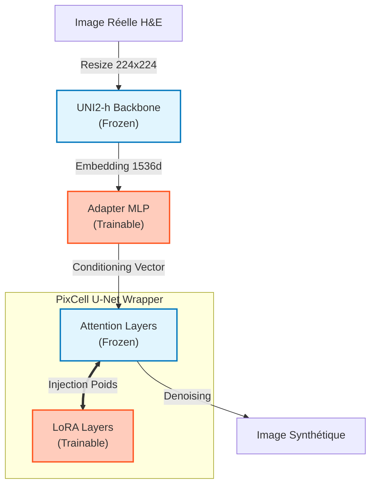

-----

# 🧠 PixCell Adapté : Fine-tuning Hybride (Adapter + LoRA)

Ce module implémente une stratégie de **Fine-Tuning Efficace (PEFT)** pour adapter le modèle génératif PixCell au domaine spécifique de l'histopathologie colorectale (dataset NCT-CRC-HE).

Contrairement à l'approche "naïve" (Zero-Shot), cette architecture permet d'entraîner des composants légers pour corriger le **Domain Shift** (dérive de couleur et de texture) tout en conservant la puissance sémantique des Foundation Models pré-entraînés.

## 📐 Architecture Technique

Le pipeline repose sur une architecture hybride combinant des modèles gelés (*Frozen*) et des modules entraînables (*Trainable*).



### 1\. Le "Pont" Sémantique : L'Adapter

Le modèle UNI2-h produit des embeddings de dimension $1 \times 1536$. Le modèle PixCell, conçu à l'origine pour du texte ou d'autres modalités, ne peut ingérer ces vecteurs bruts.

  * **Rôle :** L'Adapter est un réseau dense (MLP) léger qui projette l'espace latent d'UNI2-h vers l'espace de conditionnement de PixCell.
  * **Pourquoi l'entraîner ?** Il apprend à "traduire" les caractéristiques médicales extraites par UNI2-h (forme des noyaux, densité) en instructions de génération compréhensibles par le U-Net.

### 2\. La Texture Fine : LoRA (Low-Rank Adaptation)

Pour adapter le style visuel (colorimétrie H\&E, grain de la lame) sans ré-entraîner les milliards de paramètres du U-Net (coûteux et instable), nous injectons des couches **LoRA**.

  * **Mécanisme d'Insertion :** Les LoRA ciblent spécifiquement les couches d'**Attention (Self-Attention & Cross-Attention)** du U-Net.
  * **Fonctionnement :** Au lieu de modifier la matrice de poids $W$ du modèle, LoRA ajoute une déviation apprise $\Delta W$ décomposée en deux matrices de rang faible $A$ et $B$ (telles que $\Delta W = A \times B$).
      * $W_{frozen}$ reste inchangé.
      * Seules les petites matrices $A$ et $B$ sont mises à jour par rétropropagation.
  * **Avantage :** Cela permet de modifier le comportement profond du modèle (comment il "attend" au conditionnement) avec \< 1% de paramètres supplémentaires.

## ⚙️ Stratégie d'Entraînement

Le succès de l'adaptation repose sur un réglage précis des hyperparamètres, critique pour éviter le "catastrophic forgetting" ou le sur-apprentissage.

### Configuration Critique

  * **Précision Mixte (FP16) :** Indispensable pour réduire l'empreinte mémoire VRAM et accélérer le calcul des gradients sur les LoRA.
  * **Optimiseur :** `AdamW` avec un *learning rate* spécifique pour les LoRA (généralement autour de `1e-4`), souvent différent de celui de l'Adapter.
  * **Noise Scheduler :** Utilisation de `DDPMScheduler` pour l'entraînement (stabilité) et bascule vers `DDIMScheduler` ou `EulerAncestral` pour l'inférence (vitesse).

### Paramètres LoRA

  * **Rank (r) :** Fixé à `4` ou `8`. Un rang faible force le modèle à capturer l'essence du style sans mémoriser les images d'entraînement par cœur.
  * **Alpha :** Facteur d'échelle (scaling) déterminant l'influence des poids LoRA par rapport aux poids gelés. Un alpha élevé renforce l'adaptation au nouveau domaine.

## 🚀 Entraînement et Inférence

### Lancement de l'entraînement

Le script gère automatiquement le chargement des poids, l'injection des LoRA via `peft` et la boucle d'entraînement.

```python
# Extrait de la configuration
config = {
    "mixed_precision": "fp16",
    "gradient_accumulation_steps": 4,  # Pour simuler un gros batch size
    "learning_rate": 1e-4,
    "lora_rank": 8,
    "lora_target_modules": ["to_k", "to_q", "to_v", "to_out.0"] # Cible les couches d'attention
}

# Lancer le training
python train_adapter_lora.py --config config.yaml
```

### Inférence

Pour générer des images, le pipeline charge le U-Net de base, puis "fusionne" ou active les poids LoRA et l'Adapter.

```python
# Chargement
pipeline = load_pixcell_base()
pipeline.load_lora_weights("path/to/lora_weights.safetensors")
adapter = load_adapter("path/to/adapter.pth")

# Génération
embedding = adapter(uni2h_encoder(input_image))
image = pipeline(embedding, num_inference_steps=50).images[0]
```

## 📊 Performance et Apports

Cette approche permet de :

1.  **Réduire le Domain Shift :** Les images générées respectent la distribution colorimétrique du dataset cible (NCT).
2.  **Améliorer la Fidélité Morphologique :** Grâce à l'Adapter, le conditionnement par UNI2-h est mieux respecté qu'avec une approche naïve.
3.  **Modularité :** Les poids LoRA (\~100 Mo) peuvent être partagés facilement sans fournir le modèle complet (plusieurs Go).